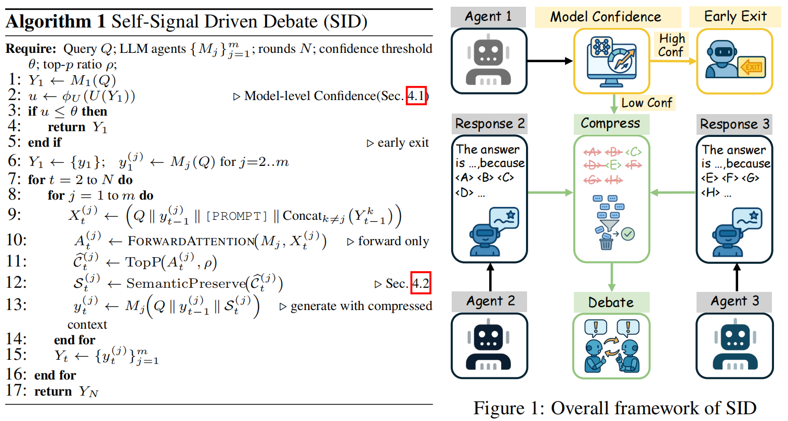

# SID: Multi-LLM Debate Driven by Self Signals

This is a preliminary implementation of the paper "SID: Multi-LLM Debate Driven by Self Signals". More tasks and settings will be released soon. 

The architecture of our model(SID) is shown as below:



## Running Experiments

### 0. You may need huggingface-cli to download the models and datasets. `huggingface-cli login`

### 1. Create conda environment(Optional)
```
conda create -n expSID -y python=3.10
conda activate expSID
```

### 2. Install dependecies

```
pip install -r requirements.txt
```

### 3. Running Experiments


```
cd scripts

# <model>, <strategy>, <dataset> are placeholders for the actual values.
# llm experiments
python exp_llm.py --model_name=<model> --strategy=<strategy> --dataset=<dataset>

# mllm experiments
python exp_mllm.py --model_name=<model> --strategy=<strategy> --dataset=<dataset>
```

More optional parameters can be found in `exp_llm.py/exp_mllm.py` or `config.py`.


## Acknowledgement

We appreciate the following github repos a lot for their valuable code base:

https://github.com/composable-models/llm_multiagent_debate

https://github.com/MraDonkey/DMAD
